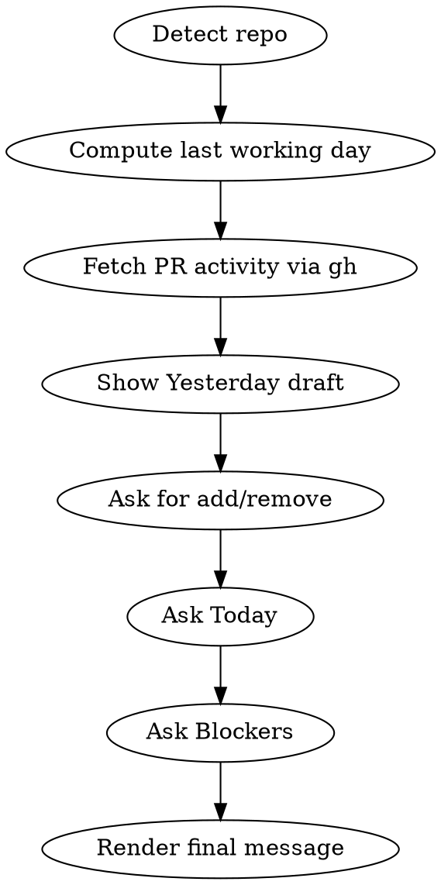

# Daily Standup

## Overview

Produce a copy-paste-ready Slack standup message in the classic **Yesterday / Today / Blockers** format. "Yesterday" is auto-filled from the user's PR activity in the current repo; "Today" and "Blockers" are collected interactively.

**Core principle:** The final message must paste cleanly into Slack with no weird characters, no rendering glitches, and no manual cleanup.

## When to Use

- User asks for their daily standup
- User invokes `/standup` or similar
- User says "draft my standup" or "let's do standup"

**Do NOT use for:** weekly summaries, retrospectives, incident reports, PR descriptions, or any multi-day status update.

## Process



### Step 1: Detect the current repo

Run `git remote get-url origin` and parse `owner/repo` from the URL. Handle both SSH (`git@github.com:owner/repo.git`) and HTTPS (`https://github.com/owner/repo.git`) forms. Strip the trailing `.git`.

**Abort early if:**
- Not in a git repo → tell user: "Not in a git repository. `cd` into a repo first."
- No `origin` remote → tell user: "No `origin` remote found on this repo."
- `gh` not authenticated (`gh auth status` fails) → tell user: "Run `gh auth login` first."

### Step 2: Compute "yesterday"

"Yesterday" means **the last working day** (Mon–Fri):

| Today is | Yesterday is |
|----------|--------------|
| Monday   | Friday (3 days ago) |
| Tuesday–Friday | Previous calendar day |
| Saturday | Friday (1 day ago) |
| Sunday   | Friday (2 days ago) |

Compute the date as `YYYY-MM-DD` in the user's local timezone. Use `date -v-Nd +%Y-%m-%d` on macOS (e.g., `date -v-3d` for Friday from Monday).

### Step 3: Fetch PR activity

Run these two `gh` commands in parallel, scoped to the detected repo and filtered to the computed date. Use `--json` for structured output:

```bash
# Merged by me
gh pr list --repo <owner/repo> --author @me --state merged \
  --search "merged:>=<yesterday-date>" \
  --json number,title,mergedAt --limit 20

# Opened by me (still open or closed-without-merge)
gh pr list --repo <owner/repo> --author @me \
  --search "created:>=<yesterday-date>" \
  --json number,title,state,createdAt --limit 20
```

Deduplicate by PR number (a PR you opened and merged will appear in both lists). Prefer the most informative verb: `merged` > `opened`.

Do NOT fetch or show reviewed PRs — only PRs authored by the user.

### Step 4: Show Yesterday draft

Present the bulleted list to the user, labeling each item with its verb. If the PR title or branch contains a Linear ticket ID (e.g., `ENG-123`, `PROJ-456`), include it. Do NOT include GitHub URLs or PR links.

```
Here's what I found from <yesterday-date>:

• merged: <PR title> (ENG-123)
• opened: <PR title> (PROJ-456)

Anything to add or remove? (Reply "none" to keep as-is.)
```

If zero items: say so explicitly — "No PR activity found for <date>. What did you work on?"

Apply the user's edits. Accept free-text additions and numbered removals (e.g., "remove 2, add: paired with Alex on spec").

### Step 5: Ask for today

Ask: **"What's on the agenda today?"**

Accept free-text. Normalize to a bullet list — one bullet per line the user gave you. Don't editorialize.

### Step 6: Ask for blockers

Ask: **"Any blockers? (Reply 'none' if clear.)"**

Accept free-text or `none` / `no` / empty → render as `None`.

### Step 7: Render the final message

Format as Slack-paste-safe plain text.

**Do not use Slack's markdown syntax** (`*bold*`, `_italic_`) — when the user copies from the terminal, the raw asterisks/underscores paste literally into Slack and do NOT render as formatting.

Instead, render headers using **Unicode mathematical italic characters** (block `U+1D608`–`U+1D63B` for bold italic, or `U+1D434`–`U+1D467` for italic). These are real glyphs that display as italic/bold in ANY destination, including Slack, with no markdown parsing needed.

Mapping (Mathematical Italic, U+1D434+):
- `A`→`𝐴` `B`→`𝐵` ... `Z`→`𝑍`
- `a`→`𝑎` `b`→`𝑏` ... `z`→`𝑧`
- Digits: use regular digits (no italic digit block in BMP)
- Spaces, punctuation, em-dashes: use as-is

Example rendering:

```
𝐷𝑎𝑖𝑙𝑦 𝑆𝑡𝑎𝑛𝑑𝑢𝑝 — <today, e.g. Wed Apr 15>

𝑌𝑒𝑠𝑡𝑒𝑟𝑑𝑎𝑦
• <item>
• <item>

𝑇𝑜𝑑𝑎𝑦
• <item>
• <item>

𝐵𝑙𝑜𝑐𝑘𝑒𝑟𝑠
• <blocker>
```

Present the message inside a fenced code block so the user can triple-click + copy cleanly. After the code block, say: "Copy the block above into Slack."

## Formatting rules (Slack-paste-safe)

| Do | Don't |
|----|-------|
| Unicode italic glyphs (`𝑌𝑒𝑠𝑡𝑒𝑟𝑑𝑎𝑦`) for headers | `*Yesterday*` or `_Yesterday_` — renders as literal symbols when pasted |
| `•` bullets (U+2022, one byte in UTF-8) | `-` or `*` bullets (ambiguous in Slack) |
| Linear ticket IDs inline (e.g., `ENG-123`) | GitHub URLs or `[text](url)` links |
| Plain hyphen `-` in dates | Em-dash `—` inside URLs or code |
| Blank line between sections | Extra trailing whitespace |
| `None` (capitalized) for empty blockers | Omitting the Blockers section entirely |

## Common Mistakes

| Mistake | Fix |
|---------|-----|
| Using Slack markdown (`*bold*`, `_italic_`, `**bold**`, `[text](url)`) | Use Unicode italic glyphs directly; raw URLs |
| Querying all repos instead of just the current one | Always scope with `--repo <owner/repo>` |
| Counting weekend days as "yesterday" on Monday | Monday's yesterday is Friday |
| Forgetting to dedupe PRs across the three queries | Dedup by PR number before rendering |
| Truncating long PR titles | Keep the full title — Slack handles wrapping |
| Silently dropping Step 4 confirmation | Always show the draft and ask before proceeding |
| Skipping `gh auth status` precheck | Check auth before querying — clearer error |
