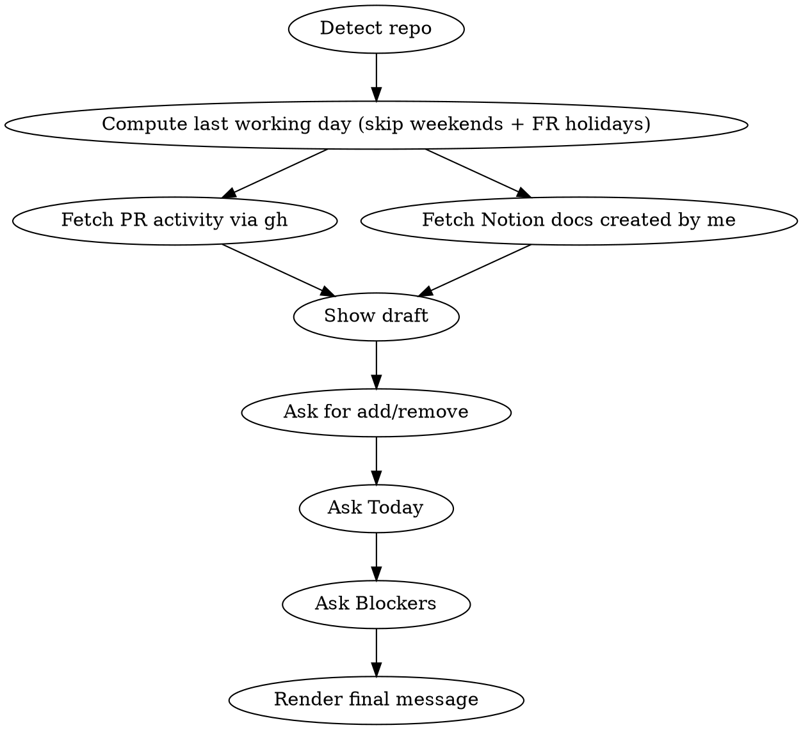

# Daily Standup

## Overview

Produce a copy-paste-ready Slack standup message in the classic **Yesterday / Today / Blockers** format. The "Yesterday" section is auto-filled from the user's PR activity in the current repo *and* Notion pages they created since their last working day (weekends + French bank holidays skipped); "Today" and "Blockers" are collected interactively. The section header is labeled `Yesterday` only when the last working day was literally yesterday — otherwise `Since <weekday>` (e.g. `Since Friday`).

**Core principle:** The final message must paste cleanly into Slack with no weird characters, no rendering glitches, and no manual cleanup.

## When to Use

- User asks for their daily standup
- User invokes `/standup` or similar
- User says "draft my standup" or "let's do standup"

**Do NOT use for:** weekly summaries, retrospectives, incident reports, PR descriptions, or any multi-day status update.

## Process


```dot
digraph standup {
  "Detect repo" -> "Compute last working day (skip weekends + FR holidays)";
  "Compute last working day (skip weekends + FR holidays)" -> "Fetch PR activity via gh";
  "Compute last working day (skip weekends + FR holidays)" -> "Fetch Notion docs created by me";
  "Fetch PR activity via gh" -> "Show draft";
  "Fetch Notion docs created by me" -> "Show draft";
  "Show draft" -> "Ask for add/remove";
  "Ask for add/remove" -> "Ask Today";
  "Ask Today" -> "Ask Blockers";
  "Ask Blockers" -> "Render final message";
}
```

### Step 1: Detect the current repo

Run `git remote get-url origin` and parse `owner/repo` from the URL. Handle both SSH (`git@github.com:owner/repo.git`) and HTTPS (`https://github.com/owner/repo.git`) forms. Strip the trailing `.git`.

**Abort early if:**
- Not in a git repo → tell user: "Not in a git repository. `cd` into a repo first."
- No `origin` remote → tell user: "No `origin` remote found on this repo."
- `gh` not authenticated (`gh auth status` fails) → tell user: "Run `gh auth login` first."

### Step 2: Compute the last working day

The last working day is the most recent day that is **not a weekend and not a French bank holiday**. Step back one day at a time from today − 1 until both conditions hold.

French jours fériés (computed from year, no hardcoded list):
- Fixed: 01-01, 05-01, 05-08, 07-14, 08-15, 11-01, 11-11, 12-25
- Easter-derived (Gauss algorithm): Easter Monday (E+1), Ascension (E+39), Pentecost Monday (E+50)

Run this `python3` one-liner — outputs the last working day as `YYYY-MM-DD` plus the weekday name, separated by `|`:

```bash
python3 - <<'PY'
import datetime
def easter(y):
    a=y%19; b,c=divmod(y,100); d,e=divmod(b,4)
    f=(b+8)//25; g=(b-f+1)//3
    h=(19*a+b-d-g+15)%30; i,k=divmod(c,4)
    l=(32+2*e+2*i-h-k)%7; m=(a+11*h+22*l)//451
    mo=(h+l-7*m+114)//31; da=((h+l-7*m+114)%31)+1
    return datetime.date(y,mo,da)
def fr(y):
    e=easter(y); td=datetime.timedelta
    return {datetime.date(y,1,1),datetime.date(y,5,1),datetime.date(y,5,8),
            datetime.date(y,7,14),datetime.date(y,8,15),datetime.date(y,11,1),
            datetime.date(y,11,11),datetime.date(y,12,25),
            e+td(days=1),e+td(days=39),e+td(days=50)}
d=datetime.date.today()-datetime.timedelta(days=1)
while d.weekday()>=5 or d in fr(d.year):
    d-=datetime.timedelta(days=1)
print(f"{d.isoformat()}|{d.strftime('%A')}")
PY
```

Capture both values: `<last-working-date>` (e.g. `2026-05-08`) and `<last-working-weekday>` (e.g. `Friday`). The date is used as the lower bound for all queries; the weekday name is used in the section label (Step 5).

Note: the search window deliberately starts at the last working day and runs through *now*, so any work the user did on a weekend or holiday between then and now still surfaces.

### Step 3: Fetch PR activity

Run these three `gh` commands in parallel, scoped to the detected repo. Use `--json` for structured output:

```bash
# Merged by me on the target date
gh pr list --repo <owner/repo> --author @me --state merged \
  --search "merged:>=<yesterday-date>" \
  --json number,title,mergedAt --limit 20

# Opened by me on the target date (any current state)
gh pr list --repo <owner/repo> --author @me \
  --search "created:>=<yesterday-date>" \
  --json number,title,state,createdAt --limit 20

# Currently open PRs authored by me (no date filter — surfaces in-flight work)
gh pr list --repo <owner/repo> --author @me --state open \
  --json number,title,createdAt,isDraft --limit 30
```

All three queries feed a **single Yesterday list**. Assign each PR exactly one verb in this priority order, then dedupe by PR number:

1. `merged` — in the merged-by-me list (merged on the target date).
2. `opened` — in the opened-on-target-date list and not already labeled `merged`.
3. `open` — in the currently-open list and not already labeled. This surfaces older lingering PRs awaiting review.

Sort the final list as: all `merged` first, then `opened`, then `open`. Within each verb, keep the order the API returned (most recent first).

Do NOT fetch or show reviewed PRs — only PRs authored by the user.

### Step 4: Fetch Notion docs created by the user

Pull pages the user **created** (not edited) in their professional Notion workspace, from `<last-working-date>` through now. Use the `mcp__claude_ai_Notion__*` tools.

**4a. Resolve the user's Notion ID** — call `mcp__claude_ai_Notion__notion-get-users` with `user_id: "self"`. Capture that user's `id` as `<me-notion-id>`. If the call fails, skip Step 4 entirely (silently — no error to the user).

**4b. Search for pages created in the window:**

Call `mcp__claude_ai_Notion__notion-search` with:
- `query_type: "internal"`
- `content_search_mode: "workspace_search"` — **REQUIRED.** Without this the call defaults to `ai_search`, which does semantic ranking and leaks results from outside both the date range and the creator filter (Slack/Linear connector hits, older Notion pages, etc.). `workspace_search` enforces strict filtering.
- `filters.created_by_user_ids: ["<me-notion-id>"]`
- `filters.created_date_range: { start_date: "<last-working-date>", end_date: "<today-date>" }`
- `query`: any short string (the field is required; filters do the actual scoping)

Keep only results with `type: "page"` — drop `slack`, `linear`, and other connector types even if they slip through. Collect each remaining result's `title` and `url`. Empty result set → silently omit the `doc:` lines from the draft (no "no new docs" placeholder).

### Step 5: Show the draft

Present a single bulleted list combining PRs and Notion docs. Verb order: `merged` → `opened` → `open` → `doc`. Mark draft PRs with `(draft)` after the title. If a PR title or branch contains a Linear ticket ID (e.g., `ENG-123`, `PROJ-456`), include it. Do NOT include GitHub URLs or PR links. For `doc:` lines, show only the page title (no URL).

**Section label rule** — pick based on the relationship between `<last-working-date>` and today:

| Condition | Label |
|-----------|-------|
| `<last-working-date>` is literally today − 1 day | `Yesterday` |
| Otherwise (weekend gap, holiday gap, etc.) | `Since <last-working-weekday>` (e.g. `Since Friday`) |

Use the same label in the confirmation prompt and in the final Slack message header.

```
Here's what I found from <last-working-date>:

• merged: <PR title> (ENG-123)
• opened: <PR title> (PROJ-456)
• open: <PR title> (ENG-789)
• open: <PR title> (draft) (ENG-790)
• doc: <Notion page title>

Anything to add or remove? (Reply "none" to keep as-is.)
```

If the combined list is empty: "No PR or Notion activity found since <last-working-date>. What did you work on?"

Apply the user's edits. Accept free-text additions and numbered removals (e.g., "remove 2, add: paired with Alex on spec").

### Step 6: Ask for today

Ask: **"What's on the agenda today?"**

Accept free-text. Normalize to a bullet list — one bullet per line the user gave you. Don't editorialize.

### Step 7: Ask for blockers

Ask: **"Any blockers? (Reply 'none' if clear.)"**

Accept free-text or `none` / `no` / empty → render as `None`.

### Step 8: Render the final message

Format as Slack-paste-safe plain text.

**Do not use Slack's markdown syntax** (`*bold*`, `_italic_`) — when the user copies from the terminal, the raw asterisks/underscores paste literally into Slack and do NOT render as formatting.

Instead, render headers using **Unicode mathematical italic characters** (block `U+1D608`–`U+1D63B` for bold italic, or `U+1D434`–`U+1D467` for italic). These are real glyphs that display as italic/bold in ANY destination, including Slack, with no markdown parsing needed.

Mapping (Mathematical Italic, U+1D434+):
- `A`→`𝐴` `B`→`𝐵` ... `Z`→`𝑍`
- `a`→`𝑎` `b`→`𝑏` ... `z`→`𝑧`
- Digits: use regular digits (no italic digit block in BMP)
- Spaces, punctuation, em-dashes: use as-is

Example rendering (Monday, last working day was Friday):

```
𝐷𝑎𝑖𝑙𝑦 𝑆𝑡𝑎𝑛𝑑𝑢𝑝 — <today, e.g. Mon May 11>

𝑆𝑖𝑛𝑐𝑒 𝐹𝑟𝑖𝑑𝑎𝑦
• merged: <PR title> (ENG-123)
• opened: <PR title> (PROJ-456)
• open: <PR title> (ENG-789)
• doc: <Notion page title>

𝑇𝑜𝑑𝑎𝑦
• <item>
• <item>

𝐵𝑙𝑜𝑐𝑘𝑒𝑟𝑠
• <blocker>
```

When `<last-working-date>` is literally yesterday, the section header is `𝑌𝑒𝑠𝑡𝑒𝑟𝑑𝑎𝑦` instead.

Present the message inside a fenced code block so the user can triple-click + copy cleanly. After the code block, say: "Copy the block above into Slack."

## Formatting rules (Slack-paste-safe)

| Do | Don't |
|----|-------|
| Unicode italic glyphs (`𝑌𝑒𝑠𝑡𝑒𝑟𝑑𝑎𝑦` / `𝑆𝑖𝑛𝑐𝑒 𝐹𝑟𝑖𝑑𝑎𝑦`) for headers | `*Yesterday*` or `_Yesterday_` — renders as literal symbols when pasted |
| `•` bullets (U+2022, one byte in UTF-8) | `-` or `*` bullets (ambiguous in Slack) |
| Linear ticket IDs inline (e.g., `ENG-123`) | GitHub URLs or `[text](url)` links |
| Plain hyphen `-` in dates | Em-dash `—` inside URLs or code |
| Blank line between sections | Extra trailing whitespace |
| `None` (capitalized) for empty blockers | Omitting the Blockers section entirely |

## Common Mistakes

| Mistake | Fix |
|---------|-----|
| Using Slack markdown (`*bold*`, `_italic_`, `**bold**`, `[text](url)`) | Use Unicode italic glyphs directly; raw URLs |
| Querying all repos instead of just the current one | Always scope with `--repo <owner/repo>` |
| Counting weekend days as "yesterday" on Monday | Step back through weekends *and* French jours fériés |
| Calling Monday's section `Yesterday` when last working day was Friday | Use `Since <weekday>` whenever last working day ≠ today − 1 |
| Hardcoding the operator's email in the skill | Read it from `git config user.email`, then match against `notion-get-users` |
| Including Notion *edits* in the doc list | Filter on `created_by_user_ids` + `created_date_range`, never `edited_*` |
| Letting `notion-search` default to `ai_search` | Always pass `content_search_mode: "workspace_search"` — AI mode leaks results outside the date/creator filter |
| Showing Slack/Linear connector hits as "docs" | Keep only `type: "page"` results — drop everything else even if returned |
| Hardcoding a yearly list of French holidays | Compute Easter via Gauss in the Python snippet — covers every year |
| Forgetting to dedupe PRs across the three queries | Dedup by PR number before rendering — each PR appears in exactly one section |
| Splitting yesterday + open into two sections | One combined list with `merged` / `opened` / `open` / `doc` verbs; dedupe by PR number |
| Truncating long PR titles | Keep the full title — Slack handles wrapping |
| Silently dropping Step 4 confirmation | Always show the draft and ask before proceeding |
| Skipping `gh auth status` precheck | Check auth before querying — clearer error |
