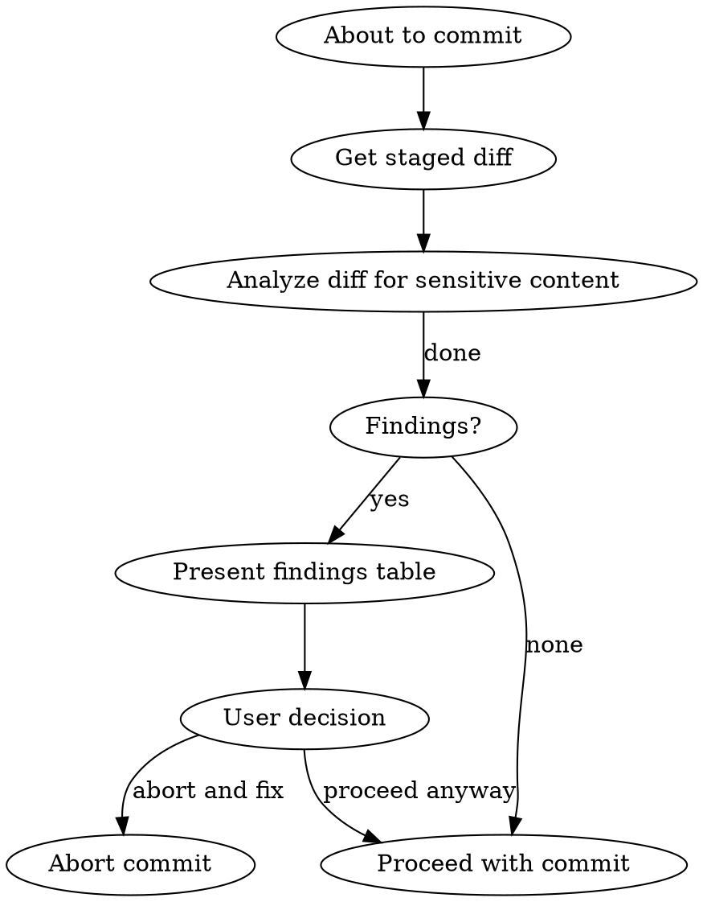

# Sensitive Content Review

## Overview

Review staged git changes for sensitive content before committing. This skill ensures that secrets, personally identifiable information (PII), and company-internal information are not accidentally committed to the repository.

**Core principle:** Never commit sensitive content without explicit user acknowledgment.

## When to Use

- Immediately before every `git commit` (including `--amend`)
- When the user invokes `/commit` or asks to commit changes
- When chained from the `git-commit` skill
- When a user explicitly asks you to review staged changes for sensitive content

**Do NOT use for:** general code review, PR review, inspecting arbitrary files, or any context where a commit is not imminent.

## Process



### Step 1: Get the staged diff

Run `git diff --cached` to obtain the full diff of what is about to be committed.

If nothing is staged, run `git diff` on the files the agent has modified in this session instead.

### Step 2: Analyze the diff

Scan **only the added lines** (lines starting with `+`) for the following categories. Ignore removed lines -- they are leaving the repo, which is fine.

#### Detection Categories

| Category | Severity | What to look for |
|----------|----------|-----------------|
| **Secrets** | HIGH | API keys, tokens (Bearer, JWT, OAuth), passwords, SSH private keys, certificates, `.env` variable values, database connection strings, AWS/GCP/Azure credentials, webhook URLs with tokens |
| **PII** | MEDIUM | Real email addresses, phone numbers, physical/postal addresses, full names in data (not code identifiers), national ID numbers, dates of birth, IP addresses tied to individuals |
| **Company info** | LOW | Internal URLs/domains (intranet, internal tools), employee names or handles in code comments, project codenames, proprietary architecture details, Slack/Teams channel names, internal documentation links, references to internal systems not meant to be public |

### Step 3: Report findings

If sensitive content is found, present a table:

```
| # | File | Line | Category | Severity | Content |
|---|------|------|----------|----------|---------|
| 1 | path/to/file.py | 42 | Secret | HIGH | `OPENAI_API_KEY = "sk-proj-abc..."` |
| 2 | config/app.yaml | 15 | PII | MEDIUM | `email: john.doe@example-corp.com` |
| 3 | docs/arch.md | 88 | Company | LOW | `See https://internal-wiki.corp.com/...` |
```

After the table, ask the user:

> **Sensitive content detected in staged changes.** See findings above.
>
> - **Proceed anyway** -- you acknowledge this content is intentional
> - **Abort and fix** -- you will modify the files before committing
>
> What would you like to do?

### Step 4: Act on user decision

- **Proceed anyway:** Continue with the normal commit flow. The user has acknowledged the content.
- **Abort and fix:** Do NOT commit. Help the user redact or remove the sensitive content if they ask.

### Step 5: No findings

If no sensitive content is detected, proceed silently to the normal commit flow. Do not announce that no sensitive content was found -- that would be noisy and add no value.

## Common False Positives

Ignore these patterns -- they are not sensitive:

| Pattern | Why it's safe |
|---------|--------------|
| `example.com`, `example.org` email addresses | RFC 2606 reserved domains |
| Placeholder keys like `sk-test-...`, `YOUR_API_KEY`, `xxx`, `changeme` | Obvious placeholders |
| `localhost`, `127.0.0.1`, `0.0.0.0` | Local addresses |
| Test fixtures with fake data (e.g., `test@test.com`, `John Doe` in test files) | Test data |
| Public documentation URLs (GitHub, Stack Overflow, RFC links) | Public info |
| Open-source license text containing names/emails | Standard attribution |
| Co-authored-by trailers | Git metadata |

## Common Mistakes

| Mistake | Fix |
|---------|-----|
| Scanning removed lines (starting with `-`) | Only scan added lines (`+`) -- removed content is leaving the repo |
| Flagging obvious test data | Check the file context -- test fixtures with fake data are fine |
| Blocking on every LOW severity finding | LOW findings are informational -- still present them but don't be alarmist |
| Skipping the review because "it's just a config change" | Config files are the most likely to contain secrets. Review everything. |
| Announcing "no sensitive content found" | Proceed silently. No news is good news. |
| Reviewing only the last file changed | Review the ENTIRE staged diff, not just recent changes |
